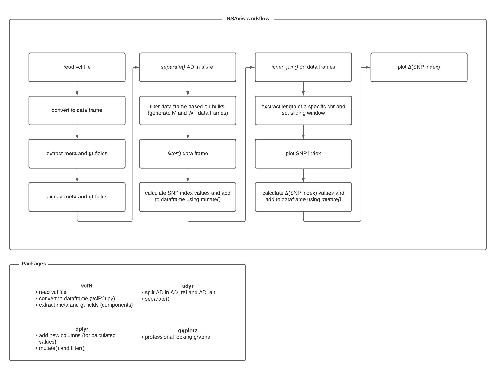

# BSAvis Package
```R
install.packages("devtools")
library(devtools)
devtools::install_github("EG-lisy/BSAvis")
library(BSAvis)

#Inspect functions
?readBSA_vcf
?calc_SNPindex
?filter_variants
?slidingWindow
?plot_SNPindex
?extract_chromLength
?calc_deltaSNPindex
?plot_deltaSNPindex
?calc_SNPratio
?plot_SNPratio
```

# BSAvis Workflow
