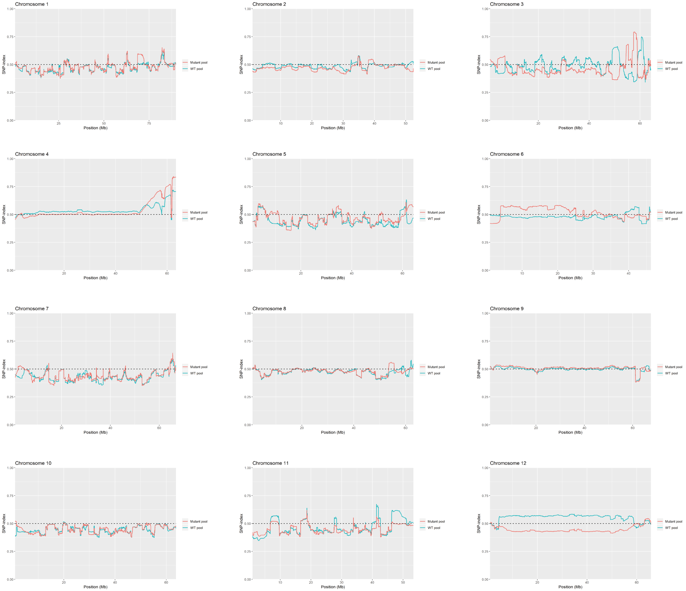
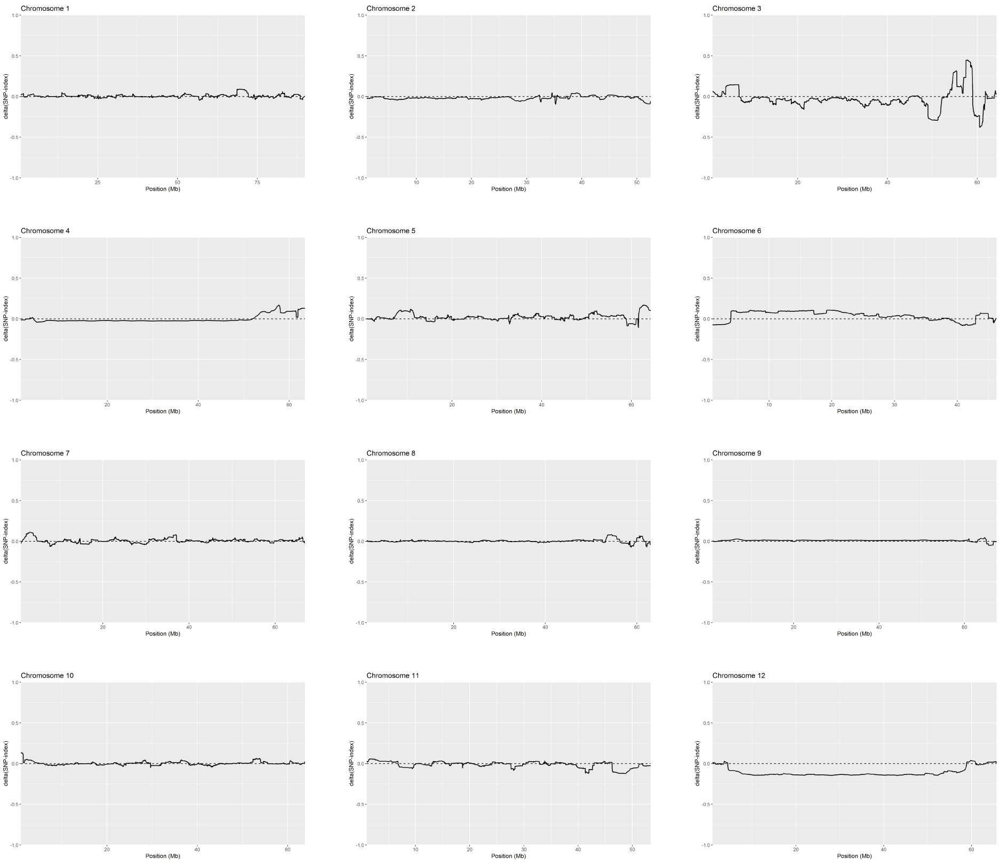
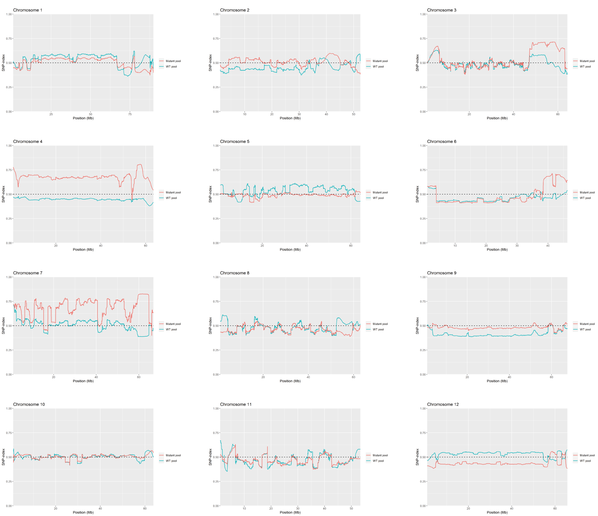
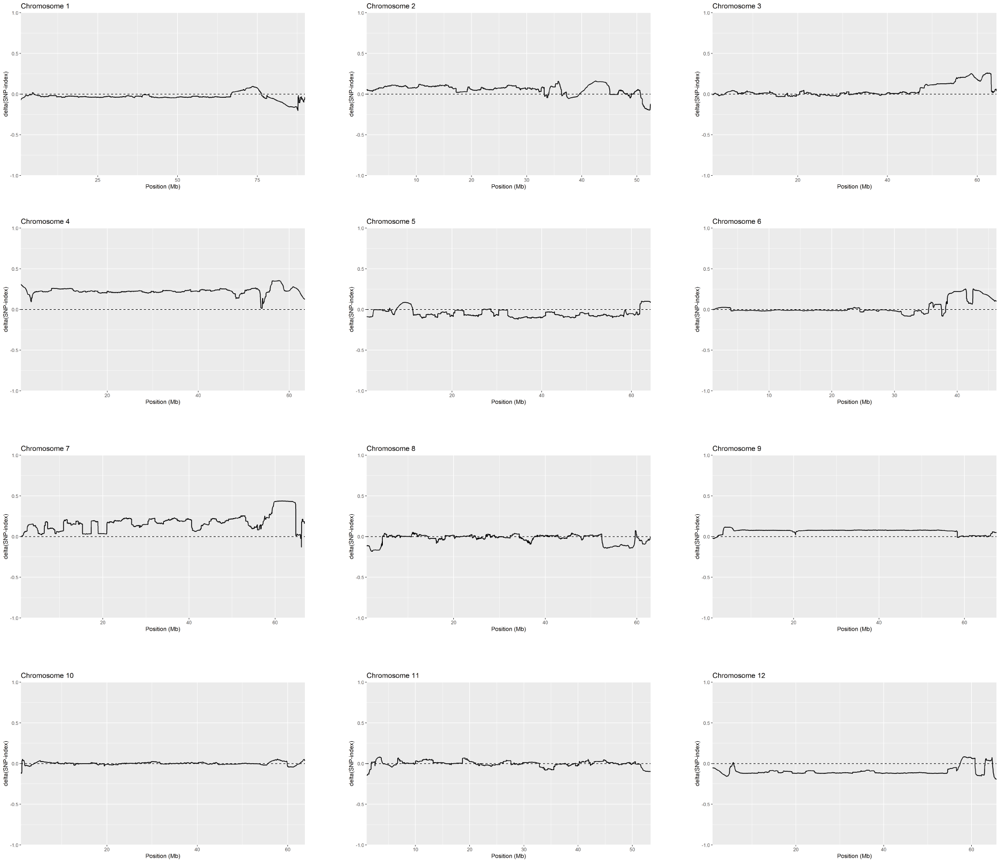
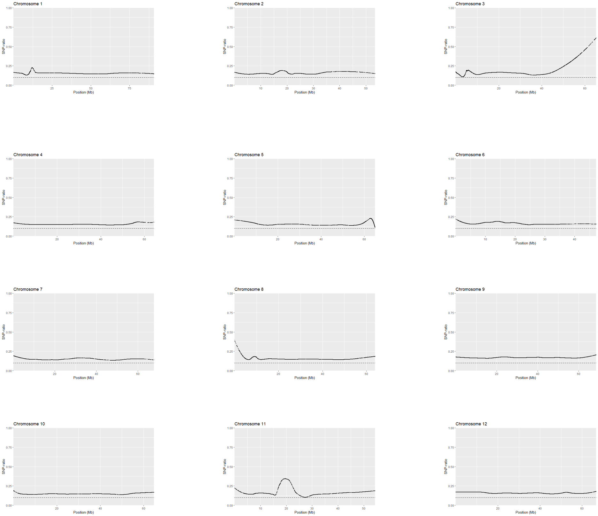
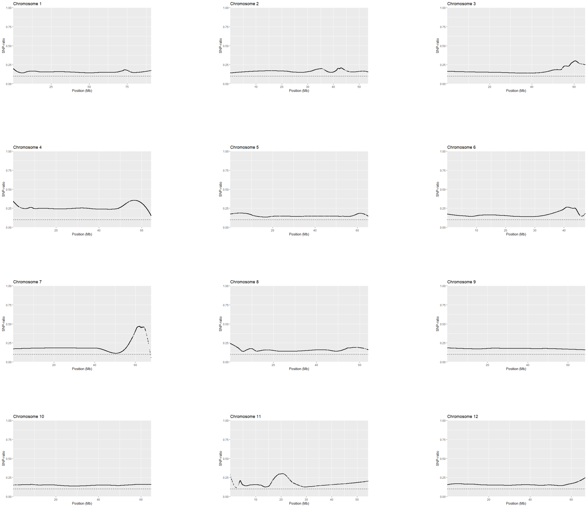

# BSAvis
## Plots
Plots generated by BSAvis package.

# SNP-index Method - Dataset One
## SNP Index
### window size=2000000 step=10000

## delta(SNP-index) 
### window size=2000000 step=10000

# SNP-index Method - Dataset Two
## SNP Index
### window size=2000000 step=10000

## delta(SNP-index) 
### window size=2000000 step=10000

# SNP-ratio Method - Dataset One
### min_SNPratio=0.1 degree=2 span=0.3

# SNP-ratio Method - Dataset Two
### min_SNPratio=0.1 degree=2 span=0.3

