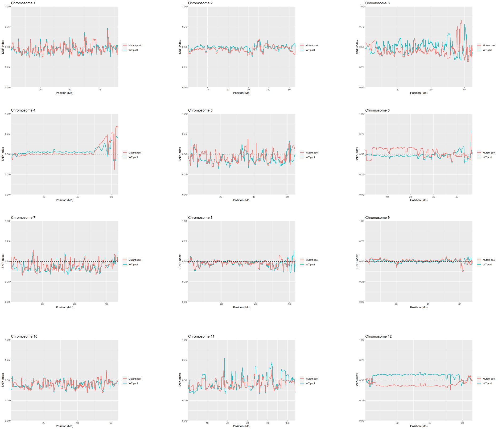
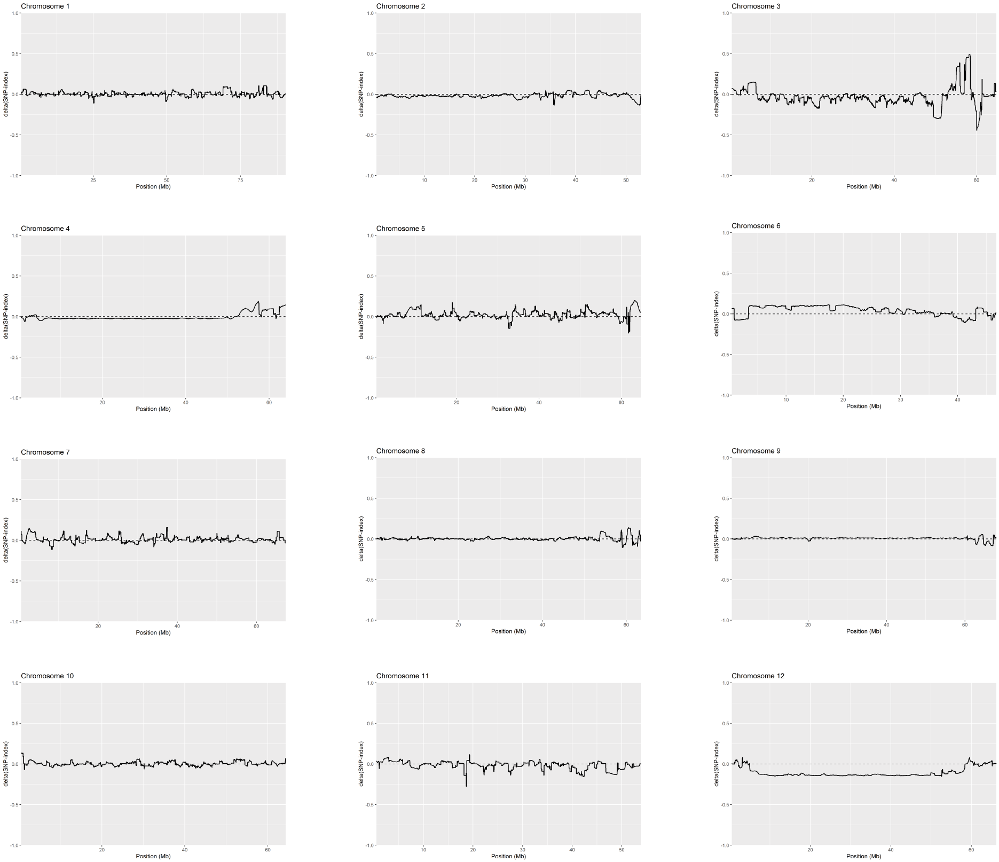
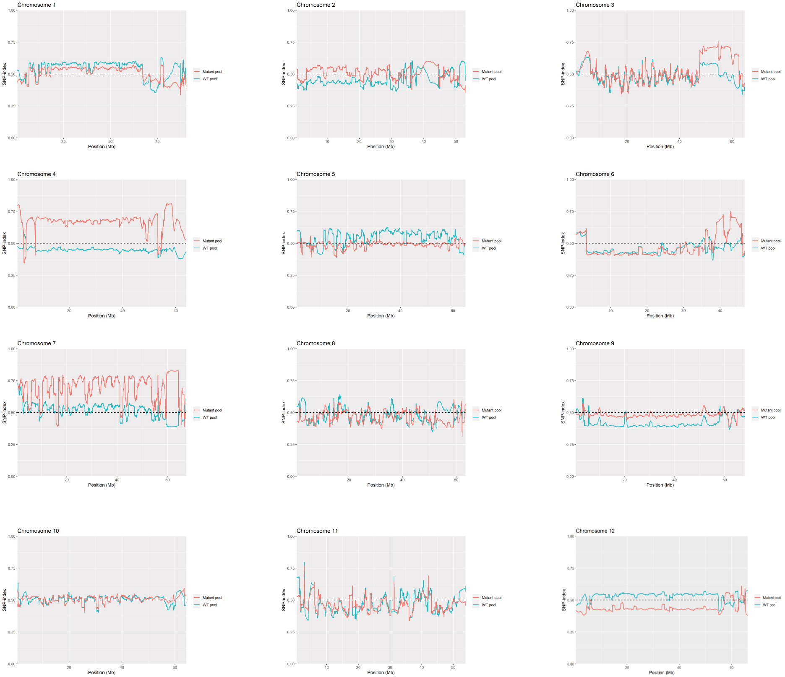
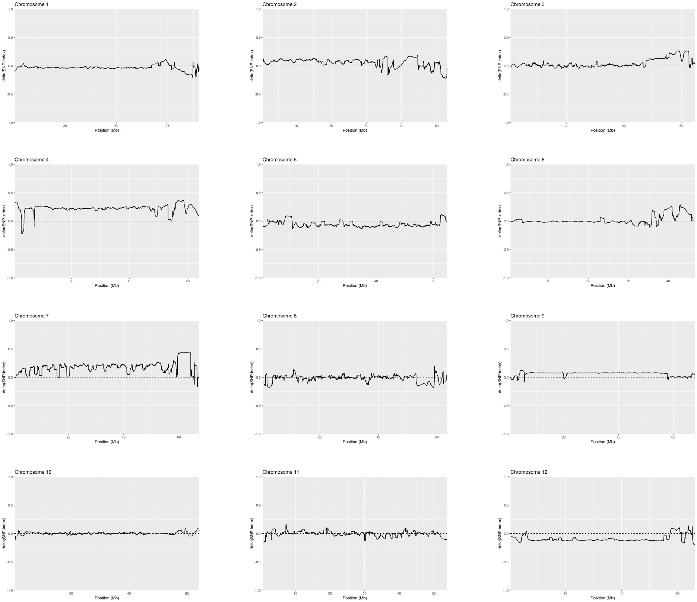
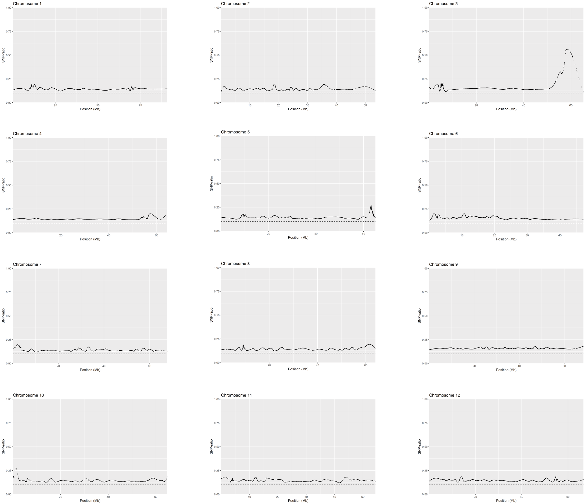
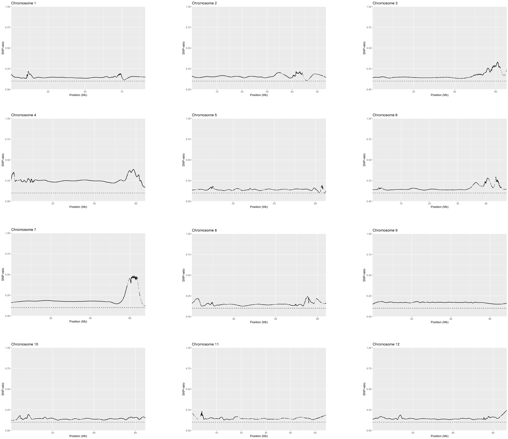

# BSAvis Plots
Plots generated using the BSAvis package.

For **dataset 1**, peaks were detected on chromosome 3.
For **dataset 2**, the most obvious peak was detected on chromosome 7. Smaller peaks were detected on chromosomes 3 and 4.

# SNP-index Method - Dataset One
## SNP Index
### window size=1000000 step=10000

## delta(SNP-index) 
### window size=1000000 step=10000

# SNP-index Method - Dataset Two
## SNP Index
### window size=1000000 step=10000

## delta(SNP-index) 
### window size=1000000 step=10000

# SNP-ratio Method - Dataset One
### degree=2 span=0.07

# SNP-ratio Method - Dataset Two
### degree=2 span=0.07

